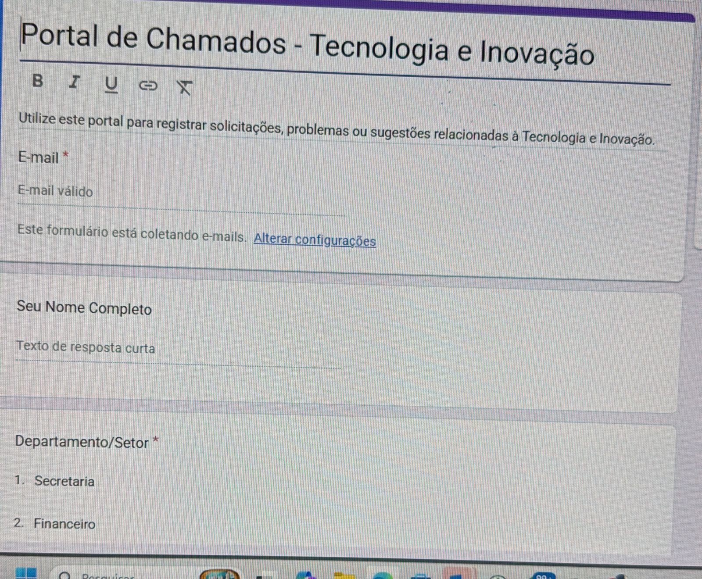
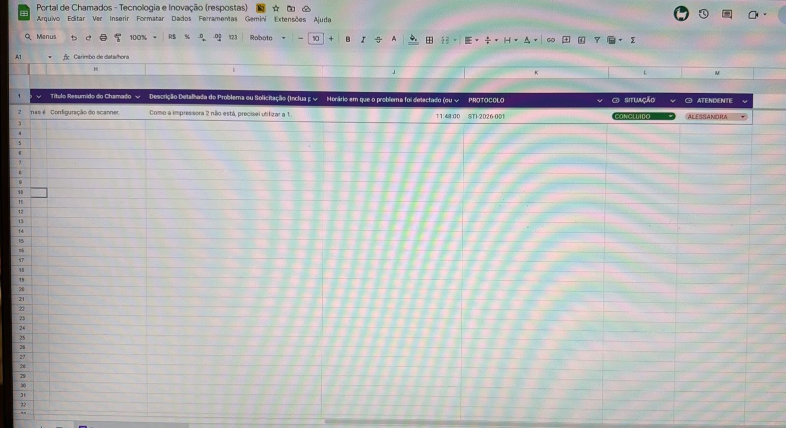

# 🛠️ STI-2026 | Sistema de Help Desk & Auditoria 

Este projeto foi desenvolvido para centralizar, automatizar e profissionalizar o suporte técnico, eliminando processos informais e garantindo a rastreabilidade total de cada chamado.
---

### 📸 Visualização do Sistema

| Interface do Formulário | Painel de Controle (TI) |
| :---: | :---: |
|  |  |

---
## 📈 Problema vs. Solução
* **Cenário Anterior:** Chamados realizados via telefone ou presencialmente, sem registro, sem histórico de solução e sem número de protocolo.
* **Solução Implementada:** Automação em **Google Apps Script** que gera protocolos sequenciais, notifica a equipe técnica e o usuário, criando um log de auditoria imutável.

## ⚙️ Funcionalidades Principais
* **Geração de Protocolo Único:** IDs automáticos no formato `STI-2026-001`.
* **Notificação Inteligente:** Disparo de e-mails em tempo real para a equipe de Suporte e confirmação para o Solicitante.
* **Gestão de Status:** Controle visual de fluxo (Pendente, Em Atendimento, Concluído) via planilha mestre.
* **Módulo de Auditoria:** Sistema paralelo para controle e registro de acesso a dados de ex-colaboradores (Conformidade e Segurança).

## 🛠️ Tecnologias e Ferramentas
* **Linguagem:** JavaScript (Google Apps Script)
* **Ambiente:** Google Workspace (Forms, Sheets, Gmail API)
* **Documentação:** Padrão técnico para manuais operacionais e treinamento de usuários.

## 🛡️ Garantia de Qualidade (QA)
Seguindo as melhores práticas de **Qualidade de Software**, o sistema conta com:
1.  **Tratamento de Concorrência:** Garantia de que dois chamados simultâneos não recebam o mesmo número.
2.  **Rastreabilidade:** Registro de e-mail e data/hora capturados automaticamente pelo sistema.
3.  **Segurança de Dados:** Separação lógica entre chamados técnicos comuns e solicitações de acesso a dados sensíveis.

## 🚀 Como Visualizar
Como o sistema roda no ambiente fechado do Google Workspace, o código-fonte principal pode ser conferido na pasta `/src` deste repositório.
